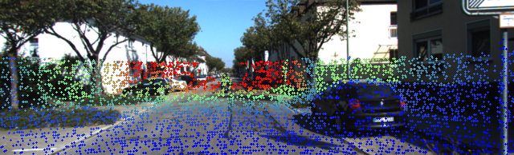
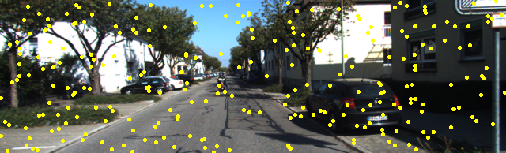
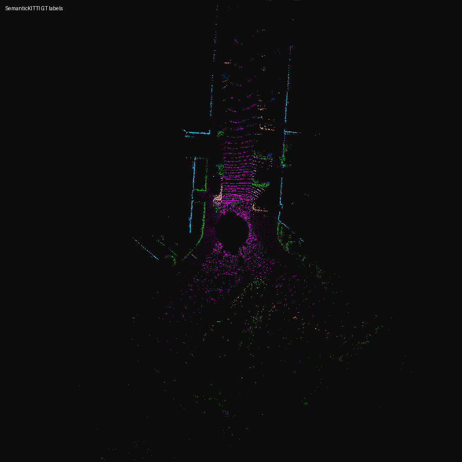
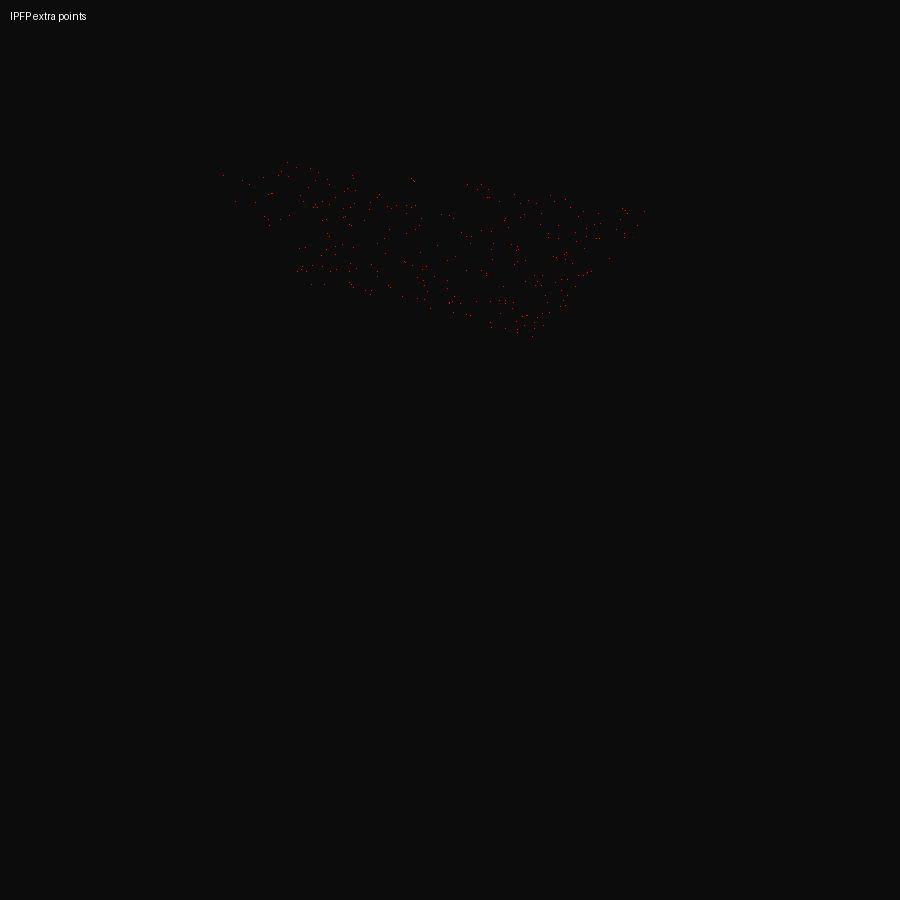
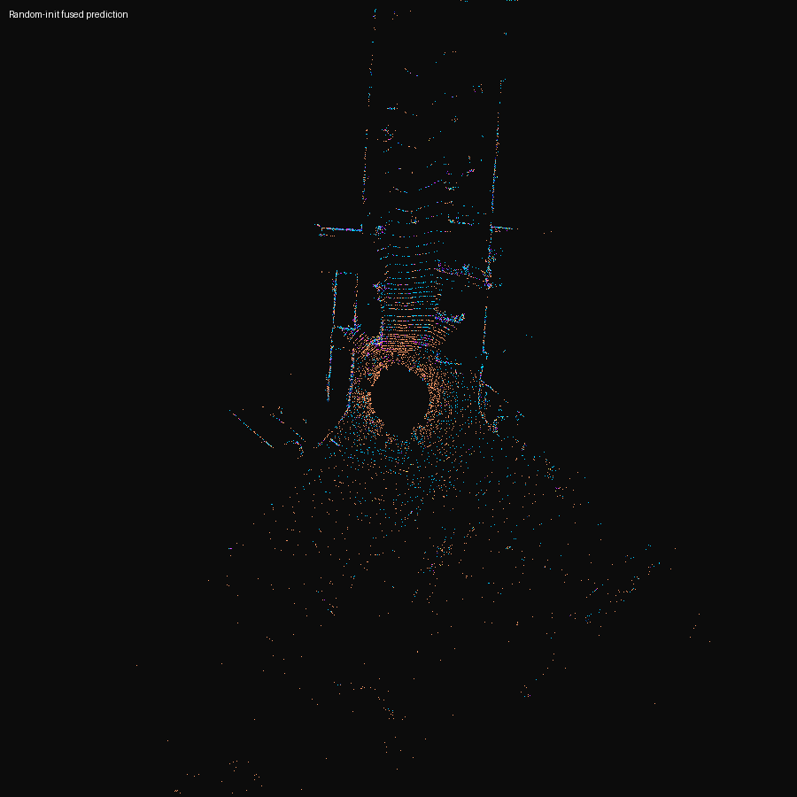
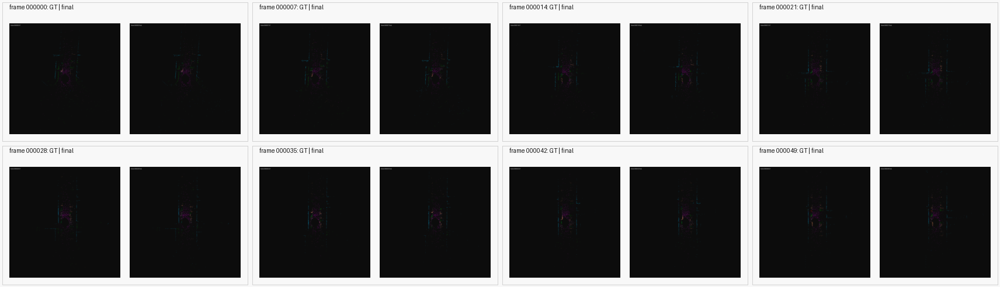
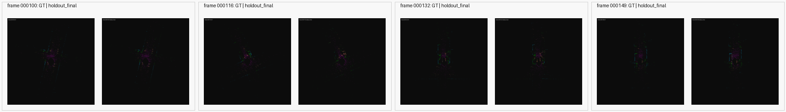
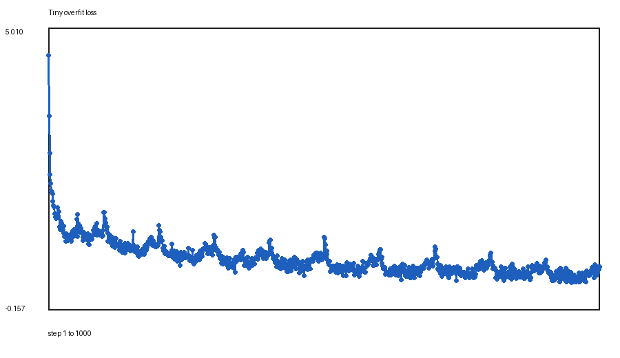
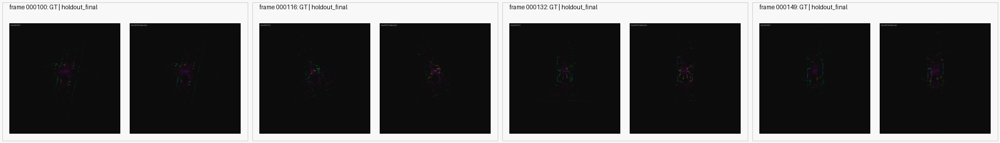

# PointCloudSemantic Code Walkthrough and Results

本文档面向刚接手本仓库的人，目标是把目前的代码、运行轨迹、实验意义、结果与可视化一次讲清楚。它不替代 README，而是解释“代码为什么这样写、每一步做了什么、结果说明了什么”。

## 1. 项目到底在复现什么

本项目围绕点云和图片的语义分割复现，当前主线是 IPFP + Pointcept/PTv3。IPFP 的核心想法是：先在图像平面选取一些深度约束的像素中心，从图像中聚合局部特征，再用 metric depth 和相机标定把这些图像 token 反投影回 LiDAR 坐标系，作为额外的 3D token 合并进 3D segmentation backbone。

当前仓库不是完整官方 benchmark trainer，而是一个由小到大的复现闭环：

1. 用 synthetic smoke test 验证 IPFP token 能接入 Pointcept/PTv3。
2. 用 nuScenes-mini 的真实 LiDAR、图像、lidarseg 标签验证 real-data closed loop。
3. 转到 SemanticKITTI，用 LiDAR、KITTI color、calib、label 做单帧可视化闭环。
4. 在 SemanticKITTI sequence `00` 做 tiny overfit，确认训练、反传、loss、可视化全链路有效。
5. 扩大到 `100 train / 50 holdout` 的 sampled-point 小 split，比较 LiDAR-only 与 fused。
6. 对比论文式设置，例如 LiDAR-only primary eval、sparse LiDAR depth inpainting、CE+Lovasz、较少 IPFP centers、token discard。
7. 做 feature gate sweep，确认图像特征不是完全无效，但 full-strength merge 会伤害结果，当前最好是 `extra-feature-scale=0.1`。

这条路线的意义是避免一上来跑 full benchmark 时把环境、数据、Pointcept、IPFP、可视化、评估指标等问题混在一起。现在的代码先证明每个局部环节能工作，再逐步扩大实验规模。

## 2. 当前目录结构

核心目录如下：

```text
PointCloudSemantic/
  ipfp/
    __init__.py
    backprojection.py
  scripts/
    smoke_ipfp_pointcept.py
    nuscenes_mini_closed_loop.py
    semantic_kitti_ipfp_visualize.py
    semantic_kitti_ipfp_tiny_overfit.py
    semantic_kitti_native_smoke.py
    run_paper_aligned_100_50.sh
    run_feature_gate_sweep_100_50.sh
    download_nuscenes_mini_semantickitti.sh
    resume_data_download_tuned.sh
    resume_data_download_resilient.sh
    check_remote_integrity.sh
    collect_latest_tiny_overfit.py
  docs/
    DATASETS.md
    REPRODUCTION.md
    EXPERIMENTS.md
    HOLDOUT_EXPERIMENTS.md
    CONTROL_EXPERIMENTS.md
    EXPANDED_SPLIT_EXPERIMENTS.md
    IPFP_ABLATION_EXPERIMENTS.md
    PAPER_ALIGNED_EXPERIMENTS.md
    SECURITY_NOTES.md
  results/
    semantic_kitti_repro/
      ...
```

其中 `ipfp/` 是最小 IPFP 模块；`scripts/` 是可执行实验脚本；`docs/` 是过程记录；`results/` 保存 summary、log、loss curve、BEV 可视化、投影可视化、montage。

## 3. 运行时的整体数据流

以当前最重要的 `scripts/semantic_kitti_ipfp_tiny_overfit.py` 为例，运行轨迹如下：

```text
SemanticKITTI frame id
  -> 读取 velodyne/*.bin, labels/*.label, image_2/*.png, calib.txt
  -> 将原始 label remap 到 19 类训练标签
  -> 用 KITTI calib 把 LiDAR 点投影到 image_2
  -> 构造 metric depth 图
       pseudo: 用投影深度分位数做一个近似深度平面
       lidar-inpaint: 用 sparse projected LiDAR depth 做 inpainting
  -> 采样 num_points 个 LiDAR 点
       至少保证一部分点能投影到图像，用于图像融合和可视化 sanity check
  -> 转 torch tensor
  -> PTv3 LiDAR-only forward 或 fused forward
       LiDAR-only: coord/intensity -> Pointcept PTv3 -> logits
       Fused: LiDAR token embedding -> IPFP extra tokens -> 合并 token -> PTv3 encoder/decoder -> logits
  -> CE 或 CE+Lovasz 训练
  -> 评估 train frames 和 holdout frames
  -> 生成 summary.json、OVERFIT_NOTES.md、overfit_log.jsonl、loss_curve.png、BEV 和图像投影可视化
```

这条链路里最重要的设计点是：fused route 并不是简单调用 `model(lidar_input)`。为了把额外 IPFP token 插到 Pointcept backbone 中间，代码手动执行了：

```text
Point.serialization()
Point.sparsify()
model.backbone.embedding()
concat LiDAR embedded token + IPFP token
Point.serialization()
Point.sparsify()
model.backbone.enc()
model.backbone.dec()
model.seg_head()
```

这样做的影响是，IPFP token 能参与 PTv3 encoder/decoder 的空间上下文建模，但最终 logits 只取回原始 LiDAR 点数量 `coord.shape[0]` 对应的部分，用 LiDAR 点的语义标签计算 loss 和指标。

## 4. `ipfp/backprojection.py`

这个文件是 IPFP 的最小实现。它不依赖 Pointcept，负责图像到 3D token 的几何和特征构造。

### `ProjectionResult`

`ProjectionResult` 是一个 dataclass，用来承载 LiDAR 点投影到图像后的中间结果：

| 字段 | 含义 | 影响 |
| --- | --- | --- |
| `uv` | 图像坐标 `[u, v]` | 后续采样图像/depth |
| `depth` | 相机坐标系下 z 深度 | 判断点是否在相机前方，也作为 sparse depth |
| `valid` | 是否落在图像范围内且深度合法 | 过滤不可用于图像监督/融合的点 |
| `points_cam` | 相机坐标系点 | 便于调试投影 |

### `_as_4x4(transform)`

接受 `[3,4]` 或 `[4,4]` 外参矩阵。如果输入是 `[3,4]`，补上一行 `[0,0,0,1]`。这样后续反投影时可以统一求逆。

影响：减少 KITTI、nuScenes、torch 实现中外参形状不一致带来的 bug。

### `_image_size_hw(depth_or_image)`

从 image/depth tensor 的最后两个维度读取 `(height, width)`。

影响：让 `[H,W]` depth 和 `[C,H,W]` image 都可以复用同一个尺寸解析逻辑。

### `project_lidar_to_image(...)`

把 LiDAR 坐标点投影到图像平面：

1. 把 LiDAR 点补齐齐次坐标。
2. 用 `lidar_to_camera` 转到 camera frame。
3. 用 camera intrinsics 得到 homogeneous pixel。
4. 除以深度得到 `uv`。
5. 根据 depth、finite、图像边界生成 `valid`。

影响：这是 IPFP 与图像分支连接的第一步。投影错了，后面 feature aggregation、depth center sampling、可视化都会错。

### `sample_map_at_uv(values_hw, uv, mode="bilinear")`

用 `torch.nn.functional.grid_sample` 在 `[H,W]` map 上按浮点 `uv` 采样。当前用于：

| 输入 map | 用途 |
| --- | --- |
| `metric_depth_hw` | 得到每个 sampled center 的 metric depth |
| `relative_depth` | 拟合 scale/shift 时读取稀疏对应深度 |

影响：保留亚像素精度，比手动 round 更稳定。

### `fit_metric_depth_from_sparse_projection(...)`

论文里会把 relative depth 通过 sparse LiDAR projection 恢复到 metric depth。这个函数实现一版鲁棒 least-squares：

```text
metric_depth = scale * relative_depth + shift
```

流程是：

1. 在 LiDAR 投影点 `projected_uv` 上采样 relative depth。
2. 用真实投影深度 `projected_metric_depth` 做 target。
3. 解最小二乘得到 `scale` 和 `shift`。
4. 按 residual sigma 过滤离群点后可再拟合一次。
5. 对整张 relative depth 图应用 scale/shift 并 clamp 到正值。

影响：它是从“相对深度估计器输出”走向“可反投影 3D 坐标”的关键桥梁。当前 SemanticKITTI 主实验暂时没有真正接 Depth Anything/UniDepth，而是通过 pseudo depth 或 sparse LiDAR inpainting 近似 metric depth，因此这个函数属于为后续深度估计器路线预留的核心能力。

### `sample_depth_constrained_centers(...)`

从 metric depth 图中采样 IPFP center。它先用 projected LiDAR depth 的 `lower_percentile` 和 `upper_percentile` 得到深度范围，然后只在 metric depth 落入该范围的像素中随机采样。

影响：

- 避免随机采到天空、图像边缘、与 LiDAR 可见深度完全不匹配的像素。
- `ipfp-lower-percentile` / `ipfp-upper-percentile` 是重要 ablation 参数。
- paper-aligned run 里从默认 `5-95` 调到 `20-99`，减少过近或离群区域约束，让 fused route 更接近 LiDAR-only baseline。

### `PatchAffinityAggregator`

这是图像局部特征聚合器，近似 IPFP paper 的 local patch affinity idea。

初始化参数：

| 参数 | 默认 | 含义 |
| --- | ---: | --- |
| `image_channels` | `3` | 输入 RGB 通道 |
| `hidden_channels` | `64` | 图像 stem 中间维度 |
| `out_channels` | `32` | 输出 token feature 维度，实际实验中设为 PTv3 第一层 embedding channel |
| `patch_size` | `9` | 每个 center 周围聚合的局部 patch |

forward 流程：

1. 输入 `[C,H,W]` 或 `[1,C,H,W]` image。
2. 两层 Conv+GELU 得到 dense image feature。
3. `sim_proj` 生成相似度空间，`value_proj` 生成 value 空间。
4. 对每个 center：
   - 取 center feature。
   - 取周围 `patch_size x patch_size` 的 patch feature。
   - 计算 patch pixel 与 center 的 similarity。
   - 用 `sigmoid(beta0 * similarity + beta1)` 得到可学习权重。
   - 用加权平均得到 center 的 image feature。

影响：它决定“图像分支给 3D backbone 输入什么特征”。后续 feature gate sweep 发现 full-strength learned feature 会伤害 holdout，而 `extra-feature-scale=0.1` 有收益，说明这里的图像特征有信号，但需要强约束或更成熟的训练策略。

### `backproject_pixels_to_lidar(...)`

把 image pixel center 和 depth 反投影回 LiDAR frame：

1. `uv -> [u,v,1]`
2. 乘 `intrinsics^-1` 得到 camera ray。
3. 乘 metric depth 得到 camera coordinates。
4. 用 `lidar_to_camera^-1` 变回 LiDAR coordinates。

影响：这是 IPFP extra point 的 3D 坐标来源。坐标会进入 Pointcept 的 voxel/grid 结构，影响 PTv3 的空间 attention 和 sparse structure。

### `IPFPFeatureBackProjector`

这是对以上组件的封装模块。它的 `forward` 一次性完成：

1. LiDAR 点投影到图像。
2. 可选 relative depth -> metric depth 拟合。
3. 深度约束采样 centers。
4. 在 metric depth 图上读 center depth。
5. `PatchAffinityAggregator` 生成 image feature。
6. 反投影 centers 得到 extra 3D coords。
7. 训练时按 `discard_probability` 随机丢弃部分 extra token。
8. 返回 `coord`、`feat`、`uv`、`depth`、`metric_depth`、`scale`、`shift` 等信息。

它带来的直接影响是把 2D 图像信息变成可以和 LiDAR token 一起送入 PTv3 的 3D token。当前所有 fused 实验都围绕这个模块展开。

## 5. `ipfp/__init__.py`

这个文件只做公开 API 导出：

```python
from .backprojection import (
    IPFPFeatureBackProjector,
    PatchAffinityAggregator,
    backproject_pixels_to_lidar,
    fit_metric_depth_from_sparse_projection,
    project_lidar_to_image,
    sample_depth_constrained_centers,
)
```

影响：脚本中可以直接写 `from ipfp import IPFPFeatureBackProjector`，不必知道内部文件名。

## 6. `scripts/smoke_ipfp_pointcept.py`

这个脚本是最早的合成数据 smoke test。它不依赖真实数据集，目的是确认 IPFP token 和 Pointcept/PTv3 能在当前 CUDA 环境里接起来。

### 主要函数

| 函数 | 作用 | 影响 |
| --- | --- | --- |
| `parse_args()` | 读取 Pointcept 路径、点数、图像大小、device 等 | 让脚本能在不同机器路径下跑 |
| `make_synthetic_camera_scene()` | 生成随机 3D 点、RGB gradient image、metric depth、intrinsics、identity extrinsics | 不依赖数据集即可验证张量形状 |
| `grid_coord_from_coord()` | 把连续坐标转 Pointcept 需要的整数 voxel grid | 对接 Pointcept `Point` 结构 |
| `main()` | 构建 PTv3、构建 IPFP、跑 LiDAR-only logits、生成 extra token、手动合并 token 再跑 PTv3 encoder/decoder | 验证最小“IPFP -> PTv3”路径是否能出 logits |

### 它回答的问题

这个脚本只回答“环境和张量管道是否能工作”。它不回答真实数据语义分割效果。

成功信号包括：

- `lidar_only_logits` shape 合法。
- `ipfp_extra_coord` 和 `ipfp_extra_feat` shape 合法。
- `ipfp_training_like_logits` shape 合法。
- 打印 `smoke_test OK`。

## 7. `scripts/nuscenes_mini_closed_loop.py`

这个脚本是第一个真实数据闭环，使用 nuScenes-mini 和 lidarseg-mini。

### 为什么先做 nuScenes-mini

nuScenes-mini 比 full SemanticKITTI 更小，适合先验证：

- 真实 LiDAR 文件能读。
- 真实相机图像能读。
- 标定链路能把 LiDAR 投到相机。
- lidarseg label 能和点数对齐。
- IPFP extra token 能生成。
- Pointcept/PTv3 forward 和 CE loss 都是 finite。

### 主要函数

| 函数 | 作用 | 影响 |
| --- | --- | --- |
| `parse_args()` | 设置 root、data-root、sample-index、num-points、num-centers 等 | 支持快速换样本和规模 |
| `as_matrix(record, inverse=False)` | 用 nuScenes translation/rotation 生成 transform matrix | 统一 ego pose 和 sensor calibration |
| `lidar_to_camera_matrix(nusc, lidar_token, camera_token)` | 组合 LiDAR calibrated sensor、LiDAR ego pose、camera ego pose、camera calibrated sensor | 正确得到 LiDAR 到 camera 的外参 |
| `project_np()` | numpy 版 LiDAR 点投影 | 选取 CAM_FRONT 可见点和 depth |
| `grid_coord_from_coord()` | 构造 Pointcept grid coord | 对接 PTv3 |
| `main()` | 加载 nuScenes sample、采样点、构造 pseudo metric depth、跑 LiDAR-only/fused logits 和 loss | 验证真实数据闭环 |

### 关键局限

Pointcept 原生 nuScenes preprocessing 面向 full `v1.0-trainval/test`，对 mini 并不是直接可跑的 benchmark 入口。因此这个脚本绕开 full preprocessing，直接从 raw sample 建最小 batch。它的作用是 closed-loop sanity check，而不是 nuScenes 官方评测。

## 8. `scripts/semantic_kitti_ipfp_visualize.py`

这个脚本是 SemanticKITTI 单帧可视化闭环。它主要用于检查 KITTI color、calib、LiDAR、label 和 IPFP 投影是否在同一坐标体系下。

### 全局常量

| 常量 | 作用 |
| --- | --- |
| `LEARNING_MAP` | 把 SemanticKITTI raw label id 映射到 19 类训练 label，忽略类变成 `-1` |
| `CLASS_COLORS` | 19 类 BEV 可视化颜色 |

### 主要函数

| 函数 | 作用 | 影响 |
| --- | --- | --- |
| `parse_args()` | 读取 root、sequence、frame、num-points、num-centers、image-width 等 | 控制单帧可视化规模 |
| `parse_calib(path)` | 解析 KITTI `calib.txt` 中的 `P2` 和 `Tr` | 后续投影和反投影依赖它 |
| `as_4x4(mat34)` | 把 KITTI `[3,4]` 外参补成 `[4,4]` | 兼容 torch 反投影 |
| `project_kitti(points_xyz, p2, tr, image_hw)` | 用 KITTI `P2` 和 `Tr` 把 LiDAR 点投到 image_2 | 生成 `uv/depth/valid` |
| `depth_color(depth)` | 把 depth 映射成 RGB | 让投影可视化里近远点一眼可见 |
| `draw_projection(image, uv, colors, output, radius)` | 在 RGB 图像上画点 | 检查 LiDAR 投影和 IPFP extra projection |
| `draw_bev(points, labels, output, title)` | 生成鸟瞰图 | 检查 label 分布和预测形态 |
| `grid_coord_from_coord()` | 连续坐标到 voxel grid | 对接 Pointcept |
| `main()` | 读取单帧数据，构造 depth，跑 PTv3 和 IPFP fused path，保存可视化和 summary | 单帧 sanity check |

### 它生成的典型文件

| 文件 | 含义 |
| --- | --- |
| `image_lidar_depth_projection.png` | LiDAR 点投影到相机图像，颜色表示 depth |
| `image_ipfp_extra_projection.png` | IPFP extra points 再投影回图像，黄色点表示 sampled centers |
| `bev_ground_truth_labels.png` | sampled LiDAR 点 GT label 的 BEV |
| `bev_random_init_prediction.png` | 随机初始化 fused model 的预测 BEV |
| `bev_ipfp_extra_points.png` | IPFP extra 3D token 的 BEV 分布 |
| `summary.json` | 点数、shape、loss、显存、输出列表 |

## 9. `scripts/semantic_kitti_ipfp_tiny_overfit.py`

这是当前最重要的主实验脚本。它把单帧可视化扩展成可训练、可评估、可 ablation 的 tiny overfit runner。

### 命令行参数的意义

| 参数 | 含义 | 影响 |
| --- | --- | --- |
| `--root` | 远端项目根目录，默认 `/root/autodl-tmp/ipfp_repro` | 决定数据、Pointcept、结果路径 |
| `--sequence` | SemanticKITTI sequence，默认 `00` | 当前实验都在 `00` |
| `--frames` | 训练帧列表 | 控制 tiny overfit 训练集 |
| `--eval-frames` | holdout 帧列表 | 控制泛化小评估 |
| `--num-points` | 每帧采样点数 | 越大越接近真实点云，但更慢 |
| `--num-centers` | IPFP extra token 数量 | fused 路线核心容量参数 |
| `--image-width` | resize 后图像宽度 | 影响投影分辨率和计算量 |
| `--grid-size` | Pointcept voxel grid 大小 | 影响 sparse structure |
| `--steps` | optimizer 更新次数 | 小闭环训练长度 |
| `--mode` | `lidar-only` 或 `fused` | 是否启用 IPFP token |
| `--eval-route` | `same`、`lidar-only`、`both` | fused 训练后用哪条 route 评估 |
| `--depth-mode` | `pseudo` 或 `lidar-inpaint` | metric depth 构造方式 |
| `--loss-mode` | `ce` 或 `ce-lovasz` | 是否加入 Lovasz mIoU surrogate |
| `--extra-feature-mode` | `learned` 或 `zeros` | 检查 learned image feature 是否有害 |
| `--extra-feature-scale` | learned feature 乘法 gate | 当前最关键 ablation，`0.1` 最好 |
| `--ipfp-detach` | 是否 detach extra coord/feat | 检查 IPFP 梯度耦合影响 |
| `--ipfp-lower-percentile` / `--ipfp-upper-percentile` | depth sampling 范围 | 控制 centers 的深度分布 |
| `--ipfp-discard-probability` | 训练时随机丢弃 extra token | 减少 fused token 过强耦合 |
| `--viz-frame-count` | montage 中选多少帧 | 控制可视化输出规模 |

### `compact_frame_label(frames)`

把帧列表变成短标签。例如连续 `000000 ... 000099` 会变成 `000000-000099`。

影响：结果目录名可读，不会因为 100 个 frame id 过长而难以管理。

### `remap_labels(labels_raw)`

用 `semantic_kitti_ipfp_visualize.LEARNING_MAP` 把 raw SemanticKITTI label 转成 19 类 label，忽略类为 `-1`。

影响：训练 loss 用 `ignore_index=-1`，因此 raw label 中不参与训练的类别不会污染 CE 和 mIoU。

### `update_confusion_matrix(confusion, target, pred)`

将 target/pred 更新到 `19 x 19` confusion matrix。只统计 target 和 pred 都在合法类别范围内的点。

影响：这是 mIoU、class accuracy、overall accuracy 的基础。比只看 per-frame accuracy 更能发现模型是否只学了大类。

### `metrics_from_confusion(confusion)`

从 confusion matrix 计算：

- `overall_accuracy`
- `mean_iou`
- `mean_class_accuracy`
- `frequency_weighted_iou`
- 每类 IoU、accuracy、tp、gt_count、pred_count、union
- 原始 confusion matrix

影响：把结果从“loss 下降了”推进到“哪些类学到了、哪些类坏了”。后续 docs 中的 holdout mIoU 都来自这里。

### `fmt_metric(value)` 和 `append_class_iou_notes(notes, title, metrics)`

用于把指标写进 `OVERFIT_NOTES.md`。前者处理 `None`，后者展开每类 IoU。

影响：每个结果目录都能独立解释该次实验，不必回到主文档查。

### `make_pseudo_metric_depth(projected_depth, height, width)`

在没有真实 dense metric depth 的情况下，用 projected LiDAR depth 的 5/95 分位数构造一个随图像 `x/y` 变化的平滑深度平面。

影响：这是早期闭环的临时 depth。优点是简单稳定；缺点是和真实场景几何不够一致，因此会放大 IPFP branch 的噪声。

### `make_lidar_inpaint_metric_depth(uv, depth, height, width)`

用已经投影到图像的 sparse LiDAR depth 构造 dense depth：

1. 过滤合法投影点。
2. 把 sparse depth 写到像素网格上。
3. 对空洞区域做 OpenCV inpaint。
4. Gaussian blur 平滑。
5. 已知点位置保留原始 sparse depth。
6. clamp 到 5/95 分位范围。

影响：相比 pseudo depth，它更贴近真实投影深度，是 paper-aligned diagnostic 里缩小 LiDAR-only 与 fused 差距的重要变化之一。

### `build_metric_depth(args, uv_all, depth_all, valid_all, height, width)`

根据 `args.depth_mode` 选择 pseudo depth 或 lidar-inpaint depth。如果投影点太少会报错。

影响：把 depth construction 做成可控 ablation。

### `lovasz_grad()` 和 `lovasz_softmax_flat()`

实现 Lovasz-Softmax loss 的 flat 版本，用于近似优化 IoU。

影响：CE 主要优化点级分类准确率，Lovasz 更贴近 mIoU。paper-aligned run 使用 `ce-lovasz`，让实验更接近语义分割常见训练目标。

### `compute_loss(logits, target, args)`

始终计算 CE；当 `--loss-mode ce-lovasz` 时叠加 `lovasz_weight * lovasz_loss`。

影响：统一训练和评估 loss 的计算，并把 `ce_loss/lovasz_loss` 单独写入日志。

### `primary_eval_route(args)` 和 `diagnostic_eval_route(args)`

这两个函数解决 fused 训练后的评估路线问题：

| `--eval-route` | primary eval | diagnostic eval |
| --- | --- | --- |
| `same` | 与 `--mode` 相同 | 无 |
| `lidar-only` | LiDAR-only | 无 |
| `both` | LiDAR-only | fused |

影响：这是 paper-aligned diagnostic 的关键。IPFP paper 的训练思想是多模态训练可以提升 LiDAR-only 推理，而不是一定要求推理时也输入图像 token。因此 fused training + LiDAR-only eval 是必须测试的路线。

### `load_sample(args, frame, sample_seed)`

这是数据入口函数，做了很多重要工作：

1. 定位 `velodyne`、`labels`、`image_2`、`calib.txt`。
2. 读取 LiDAR `[x,y,z,intensity]`。
3. 读取 `.label` 并 remap 到 19 类。
4. resize image，同时按 resize 比例缩放 `P2`。
5. 解析 KITTI calib，得到 `P2`、`Tr`、`intrinsics`、`lidar_to_cam_4`。
6. 对全量 LiDAR 点做投影，得到 `uv_all/depth_all/valid_all`。
7. 构造 metric depth。
8. 采样 `num_points`：
   - 优先取一部分能投影到图像的点。
   - 其余从不可见点或剩余点中补齐。
9. 对 sampled points 再投影，保存用于可视化的 `uv_sel/depth_sel/valid_sel`。
10. 返回 numpy/PIL 格式 sample dict。

影响：它决定实验输入的点分布。保留一部分 image-visible 点是为了让 IPFP 和投影可视化有足够信号；否则随机采样可能大多数点不在相机视野里。

### `sample_to_tensors(sample, device)`

把 sample 中的 numpy array 转成 GPU tensor。

影响：把数据加载和训练计算解耦，评估函数和训练循环都复用它。

### `make_generator(device, seed)`

构造带 seed 的 `torch.Generator`。

影响：IPFP center sampling 和 token discard 可以复现。

### `fused_forward(...)`

这是整个项目最关键的 forward。步骤如下：

1. 用 `coord + intensity` 构造 LiDAR point feature。
2. 用 `grid_coord_from_coord` 构造 Pointcept grid。
3. 调用 `ipfp(...)` 生成 extra token：
   - `extra["coord"]`: 反投影到 LiDAR 坐标的 3D 点。
   - `extra["feat"]`: 图像 patch affinity 聚合出的特征。
4. 可选 `ipfp_detach`，切断 extra coord/feat 的梯度。
5. 可选 `extra_feature_mode=zeros`，把图像 feature 置零，只保留 extra geometry token。
6. 可选 `extra_feature_scale != 1.0`，对 learned image feature 做 scalar gate。
7. 用 Pointcept `Point` 对原始 LiDAR token 做 serialization、sparsify、embedding。
8. 将 embedded LiDAR token 和 IPFP token 拼接。
9. 对 merged Point 再做 serialization、sparsify。
10. 通过 PTv3 encoder、decoder。
11. 用 `model.seg_head` 只对原始 LiDAR token 部分出 logits。

影响：

- 让 extra token 参与 3D backbone 的上下文建模。
- 最终 loss 仍然只监督真实 LiDAR 点，不直接监督 synthetic extra token。
- `extra-feature-scale` 可以抑制不成熟图像特征对 backbone 的扰动。
- `extra-feature-mode=zeros` 可以区分“额外 token 的几何位置”与“图像 learned feature”哪个在起作用。

### `lidar_only_forward(...)`

标准 LiDAR-only PTv3 路径：

1. `coord + intensity`。
2. 构造 grid。
3. `Point.serialization()`。
4. `Point.sparsify()`。
5. embedding、encoder、decoder、seg_head。

影响：这是所有 fused 实验的基线。没有这个强 baseline，就无法判断 IPFP 是否真的贡献收益。

### `run_forward(...)`

根据 `route` 或 `args.mode` 选择 `fused_forward` 或 `lidar_only_forward`。

影响：训练时可以用 fused，评估时可以切到 LiDAR-only，支撑 paper-aligned 路线。

### `evaluate_samples(...)`

对一组 samples 做 eval：

1. model/ipfp 设为 eval。
2. 每帧 forward。
3. 计算 loss、valid accuracy。
4. 累积 confusion matrix。
5. 保存第一帧的 pred 和 extra，供可视化使用。
6. 返回 per-frame rows、first prediction、first extra、全局 metrics。

影响：train frames 和 holdout frames 的评估走同一逻辑，减少指标口径不一致。

### `draw_loss_curve(records, output)`

用 PIL 画 loss 曲线。

影响：不用额外 matplotlib 依赖也能产出训练收敛图。

### `save_prediction_artifacts(...)`

保存单个 prefix 的可视化：

- `*_bev_ground_truth.png`
- `*_bev_prediction.png`
- `*_image_lidar_depth_projection.png`
- 如果有 IPFP extra，则保存 `*_image_ipfp_extra_projection.png`

影响：每次 initial/final/holdout/diagnostic 都能检查模型预测和几何投影是否合理。

### `save_selected_frame_visualizations(...)`

从多帧中均匀选 `viz_frame_count` 个 frame，为每帧保存 GT BEV 和 prediction BEV，并拼成 montage。

影响：单张第一帧可能有偶然性，montage 能更快观察模型是否只在某些帧好。

### `main()`

主函数是整个训练实验的生命周期：

1. 解析参数，构造输出目录。
2. 加载 Pointcept、IPFP 模块。
3. 设置随机种子和 CUDA memory stats。
4. 加载 train samples 和 holdout samples。
5. 构建 PTv3 配置：
   - 使用 Pointcept `configs/nuscenes/semseg-pt-v3m1-0-base.py`。
   - `num_classes = 19` 适配 SemanticKITTI 19 类。
   - 关闭 flash attention。
   - 调小 patch size，适合小 sampled-point 实验。
6. 如果 `mode=fused`，创建 `IPFPFeatureBackProjector`。
7. AdamW 优化 PTv3 参数和可选 IPFP 参数。
8. 训练前评估 train frames，并保存 initial artifacts。
9. 如果有 holdout，训练前评估 holdout，并保存 holdout initial artifacts。
10. 循环 `steps` 次：
    - 轮流取 train sample。
    - forward。
    - `compute_loss`。
    - backward。
    - clip grad norm。
    - optimizer step。
    - 写 `overfit_log.jsonl`。
11. 训练后评估 train frames，并保存 final artifacts。
12. 训练后评估 holdout frames，并保存 holdout final artifacts。
13. 如果 `eval-route=both`，额外跑 diagnostic fused eval。
14. 保存 selected-frame montage。
15. 保存 loss curve。
16. 写 `summary.json`。
17. 写 `OVERFIT_NOTES.md`。

影响：它把“能不能 forward”升级成“能不能 overfit、能不能 holdout、能不能 ablation、能不能解释结果”。

## 10. `scripts/semantic_kitti_native_smoke.py`

这个脚本尝试走 Pointcept 原生 SemanticKITTI dataloader 和 model。

主要函数：

| 函数 | 作用 | 影响 |
| --- | --- | --- |
| `parse_args()` | 读取 root、Pointcept config、sample-index、device | 可以换 PTv2/PTv3 原生 config |
| `move_to_device(batch, device)` | 把 batch 中 tensor 移到 GPU | 对接 model forward |
| `install_optional_dummy(name)` | 为缺失 optional packages 安装 dummy module | 避免某些 import 阻断 smoke test |
| `main()` | 构建 Pointcept dataset、取 sample、collate、build model、forward、输出 shape/loss | 验证原生 dataloader 路线 |

它为什么不是当前主线：之前 PTv2 SemanticKITTI 原生路线被 `pyg-lib>=0.6.0` / `voxel_grid` 二进制兼容问题卡住。主线改走 PTv3 + 自定义 sampled SemanticKITTI pipeline，是为了绕开这个环境阻塞，先推进 IPFP 研究闭环。

## 11. Runner 脚本

### `scripts/run_paper_aligned_100_50.sh`

这个脚本固定一个 paper-aligned diagnostic：

- train frames: `000000-000099`
- eval frames: `000100-000149`
- `num_points=2048`
- `image_width=480`
- `steps=1000`
- `loss-mode=ce-lovasz`
- `depth-mode=lidar-inpaint`

它跑两条路线：

1. `lidar_only_ce_lovasz`：LiDAR-only + CE+Lovasz。
2. `fused_train_lidar_eval`：fused training，primary eval 用 LiDAR-only，diagnostic eval 用 fused，并使用：
   - `num-centers=32`
   - `ipfp-lower-percentile=20`
   - `ipfp-upper-percentile=99`
   - `ipfp-discard-probability=0.2`

意义：比较更接近论文思路的 IPFP 多模态训练是否能提升 LiDAR-only 推理。

### `scripts/run_feature_gate_sweep_100_50.sh`

这个脚本继承 paper-aligned 设置，但 sweep：

```text
extra-feature-scale = 0.0, 0.1, 0.25, 0.5, 1.0
```

意义：

- `0.0`：只保留 extra token geometry，learned image feature 为 0。
- `0.1`：很弱的 learned image feature。
- `1.0`：full-strength learned image feature。

当前结果显示 `0.1` 最好，`1.0` 明显伤害 holdout，说明图像 feature 有信号但噪声也很强。

## 12. 数据下载和完整性脚本

### `scripts/download_nuscenes_mini_semantickitti.sh`

一次性下载并解压：

- nuScenes mini
- nuScenes lidarseg mini
- SemanticKITTI labels
- KITTI odometry calib
- KITTI odometry poses
- KITTI odometry color
- KITTI odometry velodyne

并建立 Pointcept data symlink。

影响：把原始数据组织成实验脚本默认读取的 layout。

### `scripts/resume_data_download_tuned.sh`

专门用于继续下载 KITTI color 和 velodyne，使用更激进的 `aria2c` 参数。

影响：当大文件下载慢但还没有反复失败时，提升并发和重试。

### `scripts/resume_data_download_resilient.sh`

更稳健的继续下载脚本。它按 round 运行 `aria2c`，保留 partial file，超时后继续下一轮。`USE_NETWORK_TURBO` 是可选项，并且脚本里明确说明它主要用于 GitHub/HuggingFace，对 S3/KITTI 下载不一定有效。

影响：适合长时间不稳定下载，避免手动盯进度。

### `scripts/check_remote_integrity.sh`

检查远端环境：

- host、GPU、disk。
- 项目目录、Pointcept、venv、scripts、data 是否存在。
- Pointcept git 状态。
- Python、torch、CUDA。
- SemanticKITTI sequence 文件数量。
- 最近结果目录。

影响：每次断线、扩容或换机器后，先用它判断代码和数据是否完整。

### `scripts/collect_latest_tiny_overfit.py`

在结果目录中找到最新 tiny overfit summary，并维护：

- `results/semantic_kitti_repro/LATEST`
- `results/semantic_kitti_repro/LATEST_TINY_OVERFIT`

影响：远端跑完一批实验后，可以快速定位最新结果。

## 13. 文档文件的职责

| 文件 | 职责 |
| --- | --- |
| `docs/DATASETS.md` | 数据集来源和下载链接 |
| `docs/REPRODUCTION.md` | 复现过程和环境路线 |
| `docs/EXPERIMENTS.md` | 实验总览和当前结论 |
| `docs/HOLDOUT_EXPERIMENTS.md` | holdout 小评估记录 |
| `docs/CONTROL_EXPERIMENTS.md` | LiDAR-only / fused control 记录 |
| `docs/EXPANDED_SPLIT_EXPERIMENTS.md` | 扩大到 `100/50` split 的记录 |
| `docs/IPFP_ABLATION_EXPERIMENTS.md` | IPFP learned feature、zero feature、detach 等诊断 |
| `docs/PAPER_ALIGNED_EXPERIMENTS.md` | paper-aligned 设置和 feature gate sweep |
| `docs/SECURITY_NOTES.md` | 避免提交密码、token、私钥等说明 |
| `docs/CODE_WALKTHROUGH_AND_RESULTS.md` | 当前这份完整代码导览和结果解释 |

## 14. 当前关键实验结果

这些结果都是 sampled-point 小实验，不是 SemanticKITTI 官方 benchmark。它们的价值是诊断 pipeline 和研究路线。

### 14.1 50-frame tiny overfit

| Route | Train frames | Steps | Final train loss | Best train loss | CUDA peak |
| --- | --- | ---: | ---: | ---: | ---: |
| LiDAR-only | `000000-000049` | 500 | 0.1713 | 0.1298 | 0.902 GB |
| Fused | `000000-000049` | 500 | 0.1468 | 0.1014 | 0.957 GB |

意义：两条路线都能在小训练集上下降 loss，说明训练闭环、Pointcept forward/backward、label、可视化和输出保存都工作。fused 在 train set 上能更低，但这不代表泛化更好。

### 14.2 100 train / 50 holdout expanded split

| Route | Train mIoU | Train overall acc | Holdout mIoU | Holdout overall acc |
| --- | ---: | ---: | ---: | ---: |
| LiDAR-only | 48.55% | 88.82% | 15.30% | 61.51% |
| Fused full learned feature | 41.76% | 85.02% | 13.41% | 56.67% |

意义：直接 full-strength fused 反而降低 holdout，说明问题不是“有没有图像输入”，而是图像 branch 的 feature 质量、融合强度、depth 和训练 schedule。

### 14.3 Paper-aligned diagnostic

设置变化：

- primary eval 改成 LiDAR-only。
- depth 改成 sparse LiDAR inpainting。
- loss 改成 CE+Lovasz。
- IPFP centers 从 64 降到 32。
- IPFP depth percentile 改成 `20-99`。
- IPFP token discard probability 设为 `0.2`。

| Route | Train route | Primary eval route | Holdout mIoU | Holdout overall acc | Diagnostic fused holdout mIoU |
| --- | --- | --- | ---: | ---: | ---: |
| LiDAR-only CE+Lovasz | LiDAR-only | LiDAR-only | 14.71% | 60.36% | n/a |
| Paper-aligned IPFP | Fused | LiDAR-only | 14.51% | 60.67% | 14.49% |

意义：paper-aligned 设置明显缩小了早期 full-strength fused 与 LiDAR-only 的差距，但还没有带来 mIoU 净收益。

### 14.4 Feature gate sweep

保持 paper-aligned 设置，只改变 `extra-feature-scale`。

| Extra feature scale | Holdout mIoU | Holdout overall acc | Diagnostic fused holdout mIoU | Train mIoU |
| ---: | ---: | ---: | ---: | ---: |
| 0.00 | 14.89% | 60.35% | 14.92% | 48.42% |
| 0.10 | 15.23% | 61.73% | 15.32% | 47.04% |
| 0.25 | 15.23% | 61.10% | 15.04% | 50.48% |
| 0.50 | 14.93% | 59.88% | 15.05% | 48.81% |
| 1.00 | 12.95% | 54.44% | 12.85% | 48.40% |

当前结论：

- `extra-feature-scale=0.1` 是当前最好路线。
- 它超过了 paper-aligned LiDAR-only control：`15.23%` vs `14.71%` holdout mIoU。
- `scale=1.0` 明显伤害结果，说明 learned image feature 不能 full-strength 直接合入。
- `scale=0.0` 已经比原 paper-aligned fused 好，说明 extra token geometry 本身并非坏事。

## 15. 可视化结果

下面的图片路径相对本文件所在的 `docs/` 目录。

### 15.1 单帧 SemanticKITTI 投影闭环

LiDAR depth 投影到 camera image：



IPFP extra token 再投影到 camera image：



GT label BEV：



IPFP extra point BEV：



随机初始化 fused prediction BEV：



这组图的意义是验证几何对齐：LiDAR 点能投到图像，IPFP sampled centers 能回到图像视野，extra 3D token 在 BEV 中也有合理空间分布。

### 15.2 50-frame fused tiny overfit montage



这张 montage 左右对比 GT 和 final prediction。它的意义是看模型在训练集多帧上的记忆能力，而不是泛化能力。

### 15.3 100/50 expanded LiDAR-only holdout montage


这是 `100 train / 50 holdout` 中 LiDAR-only baseline 的 holdout 预测。它是后续所有 fused 路线要超过的参照。

### 15.4 100/50 expanded fused holdout montage


这张图对应 early fused full-strength image feature。指标和视觉上都提示融合噪声较强。

### 15.5 Paper-aligned LiDAR-only holdout montage


这是 CE+Lovasz + lidar-inpaint depth 实验中的 LiDAR-only control。

### 15.6 Paper-aligned fused holdout montage


这是 paper-aligned IPFP route，训练 fused，但 primary eval 是 LiDAR-only。它缩小了早期 fused 与 LiDAR-only 的差距。

### 15.7 Feature gate `scale=0.1` holdout montage



这是当前最好路线。相比 full-strength fused，它说明更弱的 learned image feature 更适合当前 sampled-point 小实验。

### 15.8 Feature gate `scale=0.1` loss curve



loss curve 用来确认训练确实收敛，而不是只靠随机预测得到指标。

### 15.9 Feature gate `scale=1.0` holdout montage



这张图对应 full-strength learned image feature。它的 holdout mIoU 只有 `12.95%`，是当前最重要的反例：图像特征不能不加控制地合入。

## 16. 目前代码带来的研究判断

到目前为止，可以比较稳地说：

1. Pointcept/PTv3 主路线能在当前环境中工作。
2. 自定义 SemanticKITTI sampled pipeline 能读 LiDAR、label、color、calib，并能训练和保存可视化。
3. IPFP extra token 的几何投影链路是通的。
4. 早期 full-strength learned image feature 会伤害 holdout。
5. paper-aligned 调整后 fused route 不再明显崩，但还不够强。
6. feature gate 证明了 learned image feature 有可用信号，`scale=0.1` 当前最好。
7. 后续最值得推进的是把 `extra-feature-scale=0.1` 作为当前控制路线，扩大评估，同时替换更真实的 depth estimator pipeline。

## 17. 新人接手时建议先跑什么

如果只是验证环境：

```bash
python scripts/smoke_ipfp_pointcept.py --pointcept-root /root/autodl-tmp/ipfp_repro/src/Pointcept
```

如果要验证 SemanticKITTI 单帧几何：

```bash
python scripts/semantic_kitti_ipfp_visualize.py \
  --root /root/autodl-tmp/ipfp_repro \
  --sequence 00 \
  --frame 000000
```

如果要复现当前最好小实验路线：

```bash
OUT_BASE=/root/autodl-tmp/ipfp_repro/results/semantic_kitti_repro/feature_gate100_holdout50_latest \
bash scripts/run_feature_gate_sweep_100_50.sh
```

如果只跑当前最佳单个 scale，可以直接调用：

```bash
python scripts/semantic_kitti_ipfp_tiny_overfit.py \
  --root /root/autodl-tmp/ipfp_repro \
  --sequence 00 \
  --frames 000000 000001 000002 000003 000004 000005 000006 000007 000008 000009 \
  --eval-frames 000100 000101 000102 000103 000104 \
  --num-points 2048 \
  --num-centers 32 \
  --image-width 480 \
  --steps 1000 \
  --mode fused \
  --eval-route both \
  --depth-mode lidar-inpaint \
  --loss-mode ce-lovasz \
  --ipfp-lower-percentile 20 \
  --ipfp-upper-percentile 99 \
  --ipfp-discard-probability 0.2 \
  --extra-feature-scale 0.1
```

上面最后这个命令为了示例简短只列了少量 frame。正式复现 `100/50` 应使用 runner 脚本自动生成 `000000-000099` 和 `000100-000149`。

## 18. 后续最自然的推进路线

1. 固定 `extra-feature-scale=0.1`，扩大到更多 frames，检查收益是否稳定。
2. 引入更接近论文的 depth estimator 或 IP-BASIC depth pipeline，替代当前 sparse LiDAR inpainting。
3. 把 sampled-point 实验升级为更完整的 SemanticKITTI dataloader/trainer。
4. 增加 official-style full-frame mIoU，尤其是 sequence `08`。
5. 如果要重新尝试 PTv2，需要单独解决 `pyg-lib` / `voxel_grid` 二进制兼容问题；当前研究推进不依赖 PTv2。

