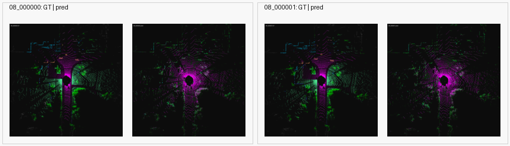
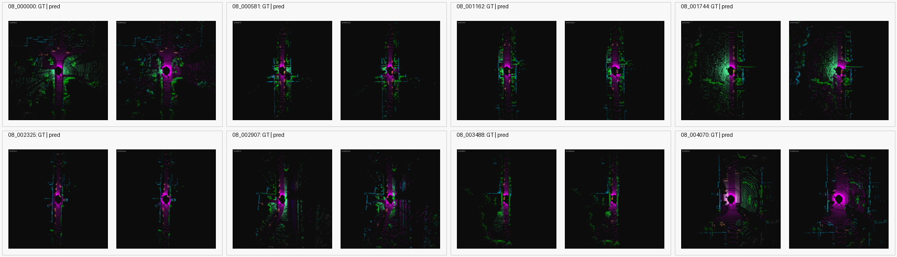

# Full Benchmark Stage 1

This stage moves the project from sampled-point holdout diagnostics toward a
SemanticKITTI sequence `08` validation benchmark.

## Scope

The new runner is `scripts/semantic_kitti_full_benchmark.py`.

It is intentionally a scaffold rather than a final official submission trainer:

- training samples points from real SemanticKITTI training frames,
- validation covers every point in every selected validation frame,
- full-frame validation is performed with chunked inference to avoid GPU OOM,
- metrics are accumulated with a frame-level confusion matrix over 19 classes,
- checkpoints, logs, per-class IoU, and selected BEV visualizations are saved.

The first target is a LiDAR-only sequence `08` validation baseline. Once this is
stable, the gated IPFP route can be run with `extra-feature-scale=0.1`.

## Default Splits

| Split | Sequences |
| --- | --- |
| Train | `00 01 02 03 04 05 06 07 09 10` |
| Validation | `08` |

## Main Commands

Sanity run:

```bash
ROOT=/root/autodl-tmp/ipfp_repro \
STEPS=2 \
TRAIN_FRAME_LIMIT=4 \
VAL_FRAME_LIMIT=2 \
EVAL_CHUNK_POINTS=8192 \
bash scripts/run_semantic_kitti_full_benchmark_stage1.sh
```

LiDAR-only stage-1 run:

```bash
ROOT=/root/autodl-tmp/ipfp_repro \
MODE=lidar-only \
STEPS=20000 \
EVAL_EVERY=0 \
CHECKPOINT_EVERY=1000 \
TRAIN_SAMPLE_POINTS=8192 \
EVAL_CHUNK_POINTS=16384 \
VAL_FRAME_STRIDE=1 \
bash scripts/run_semantic_kitti_full_benchmark_stage1.sh
```

Gated IPFP follow-up:

```bash
ROOT=/root/autodl-tmp/ipfp_repro \
MODE=fused \
STEPS=20000 \
EVAL_EVERY=0 \
CHECKPOINT_EVERY=1000 \
TRAIN_SAMPLE_POINTS=8192 \
EVAL_CHUNK_POINTS=16384 \
VAL_FRAME_STRIDE=1 \
bash scripts/run_semantic_kitti_full_benchmark_stage1.sh
```

## Outputs

Each run writes:

- `run_manifest.json`
- `train_log.jsonl`
- `val_metrics_step_*.json`
- `summary.json`
- `BENCHMARK_NOTES.md`
- `checkpoints/latest.pth`
- `checkpoints/best.pth`
- `val_viz_step_*/val_selected_frames_montage.png`

## Sanity Result

The first remote sanity run completed successfully at:

`results/semantic_kitti_full_benchmark/sanity_lidar_20260629_223612`

| Setting | Value |
| --- | ---: |
| Mode | `lidar-only` |
| Train frame limit | `4` |
| Validation frame limit | `2` |
| Steps | `2` |
| Eval chunk points | `8192` |
| Full-frame valid validation points | `232805` |
| Validation mIoU | `4.09%` |
| Validation overall accuracy | `28.90%` |
| CUDA peak memory | `1.152 GB` |

This result is not meaningful as a trained benchmark score because it only uses
two update steps. Its purpose is to prove that full-frame sequence `08`
validation can read all points, split frames into chunks, accumulate metrics,
write checkpoints, and save BEV visualizations without OOM.

Sanity artifacts included in the repository:

- `results/semantic_kitti_full_benchmark/sanity_lidar_20260629_223612/summary.json`
- `results/semantic_kitti_full_benchmark/sanity_lidar_20260629_223612/val_metrics_step_0000002_lidar-only.json`
- `results/semantic_kitti_full_benchmark/sanity_lidar_20260629_223612/val_viz_step_0000002/val_selected_frames_montage.png`



## Completed LiDAR-Only Result

The first full LiDAR-only stage-1 run completed successfully:

| Field | Value |
| --- | --- |
| Output directory | `/root/autodl-tmp/ipfp_repro/results/semantic_kitti_full_benchmark/stage1_lidar_full_20260629_223718` |
| Train sequences | `00 01 02 03 04 05 06 07 09 10` |
| Validation sequence | `08` |
| Train frame count | `19130` |
| Validation frame count | `4071` |
| Steps | `20000` |
| Train sample points | `8192` |
| Eval chunk points | `16384` |
| Full-frame valid validation points | `476757723` |
| Validation mIoU | `19.01%` |
| Validation overall accuracy | `66.93%` |
| Validation mean class accuracy | `27.67%` |
| Validation frequency-weighted IoU | `52.43%` |
| Validation mean loss | `1.7342` |
| Validation elapsed time | `30.24 min` |
| CUDA peak memory | `1.433 GB` |

Repository artifacts:

- `results/semantic_kitti_full_benchmark/stage1_lidar_full_20260629_223718/summary.json`
- `results/semantic_kitti_full_benchmark/stage1_lidar_full_20260629_223718/val_metrics_step_0020000_lidar-only.json`
- `results/semantic_kitti_full_benchmark/stage1_lidar_full_20260629_223718/BENCHMARK_NOTES.md`
- `results/semantic_kitti_full_benchmark/stage1_lidar_full_20260629_223718/val_viz_step_0020000/val_selected_frames_montage.png`



Per-class validation IoU:

| Class | IoU | Accuracy |
| --- | ---: | ---: |
| car | 47.87% | 50.84% |
| bicycle | 0.20% | 0.20% |
| motorcycle | 3.11% | 5.69% |
| truck | 1.52% | 4.05% |
| other-vehicle | 4.56% | 30.23% |
| person | 1.63% | 2.00% |
| bicyclist | 4.55% | 5.37% |
| motorcyclist | 0.00% | 0.00% |
| road | 62.83% | 90.66% |
| parking | 0.35% | 0.36% |
| sidewalk | 31.68% | 46.94% |
| other-ground | 0.01% | 0.01% |
| building | 57.83% | 77.60% |
| fence | 17.76% | 43.43% |
| vegetation | 68.40% | 78.94% |
| trunk | 7.87% | 8.29% |
| terrain | 39.19% | 45.35% |
| pole | 8.93% | 9.21% |
| traffic-sign | 2.92% | 26.47% |

Remote checkpoints are intentionally not committed:

```bash
/root/autodl-tmp/ipfp_repro/results/semantic_kitti_full_benchmark/stage1_lidar_full_20260629_223718/checkpoints/latest.pth
/root/autodl-tmp/ipfp_repro/results/semantic_kitti_full_benchmark/stage1_lidar_full_20260629_223718/checkpoints/best.pth
```

## Caveat

This is still not the SemanticKITTI official test submission path. It is the
first full-frame validation benchmark layer for sequence `08`. The official
submission route should be added only after this validation scaffold is stable.
