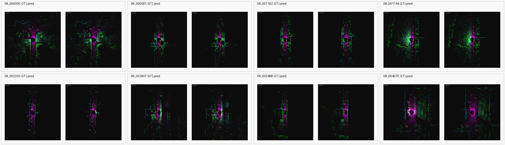

# Stage-2 Ablation Results

This note tracks the controlled ablations launched after the completed
SemanticKITTI stage-2 benchmark. The goal is to separate three effects that were
coupled in the original fused-training result:

- Extra optimization from the stronger LiDAR checkpoint.
- The changed fused-training sampling path and extra back-projected points.
- Actual learned image-feature content from the IPFP branch.

## Completed Runs

| Run | Directory | Status |
| --- | --- | --- |
| Zero feature content | `results/semantic_kitti_full_benchmark/stage2_ablate_zero_feature_20260701_1245` | complete |
| IPFP detached branch | `results/semantic_kitti_full_benchmark/stage2_ablate_ipfp_detach_20260701_1245` | complete remotely |
| LiDAR-only continued fine-tune | `results/semantic_kitti_full_benchmark/stage2_lidar_continued_30k_20260701_1245` | complete remotely |

The committed artifacts are limited to metrics JSON, manifest files, benchmark
notes, class statistics, and selected validation visualizations. Raw datasets,
checkpoints, and training logs are not included.

As of `2026-07-01 21:06 CST`, all three remote ablations finished with
`summary_status=OK`. The `zero-feature` metrics and visual artifacts are already
committed. The `ipfp_detach` and `lidar_continued` metrics below were read from
the remote summaries; their lightweight JSON/PNG artifacts still need to be
synced once the SSH transfer channel is stable again.

## Zero-Feature Configuration

The zero-feature ablation initializes from the completed stage-2 LiDAR
checkpoint and uses the same stage-2 fused-training recipe as the original
fused recovery run, except the added IPFP feature content is replaced by zeros:

| Setting | Value |
| --- | --- |
| Mode | `fused` |
| Primary eval route | `lidar-only` |
| Initialization | `stage2_lidar_stronger_20260630_115149/checkpoints/best.pth` |
| Steps | `30000` |
| Train sample points | `32768` |
| Eval chunk points | `32768` |
| Loss | CE + Lovasz |
| LR schedule | cosine, `2000` warmup, min `1e-5` |
| Class weighting | inverse sqrt frequency, clip `5.0` |
| Rare-class frame sampling | `0.45` |
| Balanced point sampling | `0.50` |
| IPFP lower / upper percentile | `20 / 99` |
| IPFP discard probability | `0.2` |
| Extra feature mode | `zeros` |
| Extra feature scale | `0.1` |

This is not a pure LiDAR-only continued run. It still exercises the fused data
path and added-point distribution, but removes learned image-feature content.

## Overall Results

Full validation uses SemanticKITTI sequence `08` with `4071` frames.

| Route | Eval route | Frames | mIoU | Overall acc | Mean loss | Delta vs LiDAR mIoU | Delta vs fused mIoU |
| --- | --- | ---: | ---: | ---: | ---: | ---: | ---: |
| Stage-2 stronger LiDAR-only | LiDAR-only | 4071 | `27.79%` | `75.59%` | `1.5952` | `0.00` | `-1.25` |
| Stage-2 fused training | LiDAR-only | 4071 | `29.04%` | `80.12%` | `1.5005` | `+1.25` | `0.00` |
| Zero-feature fused path | LiDAR-only | 4071 | `28.93%` | `79.70%` | `1.5103` | `+1.14` | `-0.12` |
| IPFP detached branch | LiDAR-only | 4071 | `28.48%` | `79.22%` | `1.5408` | `+0.69` | `-0.56` |
| LiDAR-only continued fine-tune | LiDAR-only | 4071 | `26.85%` | `73.40%` | `1.7084` | `-0.94` | `-2.19` |

The zero-feature run recovers almost all of the fused-training mIoU gain while
using no learned image-feature content. It is `+1.14` mIoU points above the
stronger LiDAR baseline and only `0.12` mIoU points below the original fused
training result.

The LiDAR-only continued control falls below the original stage-2 LiDAR
baseline, so the zero-feature gain is not explained by simply training the
LiDAR model for another `30000` steps. The useful signal is therefore tied to
the fused data path and/or added back-projected points rather than extra
optimization time alone.

## Periodic Trend

Periodic validation uses the same 256-frame subset used in the previous
stage-2 runs. The final row is the full sequence `08` validation.

| Step | Frames | mIoU | Overall acc | Mean loss |
| ---: | ---: | ---: | ---: | ---: |
| 5000 | 256 | `26.39%` | `78.34%` | `1.5058` |
| 10000 | 256 | `24.81%` | `76.17%` | `1.5777` |
| 15000 | 256 | `24.44%` | `76.57%` | `1.5326` |
| 20000 | 256 | `26.13%` | `75.35%` | `1.5969` |
| 25000 | 256 | `27.04%` | `78.69%` | `1.4931` |
| 30000 | 256 | `28.78%` | `81.30%` | `1.4120` |
| 30000 | 4071 | `28.93%` | `79.70%` | `1.5103` |

The final full-sequence score is close to the periodic 30k subset score, so the
zero-feature improvement is not only a 256-frame subset artifact.

## Ablation Trend Comparison

The periodic rows use the 256-frame validation subset. The final row uses the
full `4071`-frame sequence `08` validation.

| Route | 5k | 10k | 15k | 20k | 25k | 30k full |
| --- | ---: | ---: | ---: | ---: | ---: | ---: |
| Stage-2 fused training | `25.83%` | `23.09%` | `26.44%` | `26.81%` | `29.04%` | `29.04%` |
| Zero-feature fused path | `26.39%` | `24.81%` | `24.44%` | `26.13%` | `27.04%` | `28.93%` |
| IPFP detached branch | `25.53%` | `23.84%` | `24.40%` | `28.61%` | `27.74%` | `28.48%` |
| LiDAR-only continued fine-tune | `22.89%` | `20.27%` | `18.35%` | `19.53%` | `26.64%` | `26.85%` |

`ipfp_detach` briefly spikes at `20k`, but the full validation lands below both
zero-feature and learned-feature fused training. The LiDAR-only continued run
does not recover the stage-2 baseline score after the extra schedule.

## Class-Wise IoU

| Class | LiDAR baseline | Zero-feature | Fused training | Zero - LiDAR | Fused - Zero |
| --- | ---: | ---: | ---: | ---: | ---: |
| car | `62.99%` | `65.81%` | `67.79%` | `+2.82` | `+1.98` |
| bicycle | `5.14%` | `2.77%` | `5.34%` | `-2.36` | `+2.57` |
| motorcycle | `10.29%` | `12.68%` | `10.88%` | `+2.39` | `-1.80` |
| truck | `4.27%` | `3.42%` | `3.32%` | `-0.85` | `-0.10` |
| other-vehicle | `5.21%` | `5.35%` | `5.85%` | `+0.14` | `+0.50` |
| person | `8.48%` | `10.45%` | `9.99%` | `+1.97` | `-0.46` |
| bicyclist | `12.11%` | `8.35%` | `11.38%` | `-3.76` | `+3.03` |
| motorcyclist | `0.09%` | `0.02%` | `0.03%` | `-0.07` | `+0.01` |
| road | `77.68%` | `81.33%` | `81.75%` | `+3.65` | `+0.42` |
| parking | `8.28%` | `4.70%` | `4.98%` | `-3.58` | `+0.28` |
| sidewalk | `51.12%` | `56.89%` | `58.60%` | `+5.77` | `+1.71` |
| other-ground | `0.06%` | `0.01%` | `0.02%` | `-0.05` | `+0.01` |
| building | `67.30%` | `68.96%` | `68.59%` | `+1.66` | `-0.37` |
| fence | `19.59%` | `22.32%` | `22.12%` | `+2.73` | `-0.20` |
| vegetation | `73.91%` | `77.89%` | `78.37%` | `+3.98` | `+0.47` |
| trunk | `31.48%` | `21.55%` | `17.41%` | `-9.93` | `-4.14` |
| terrain | `59.84%` | `62.35%` | `63.99%` | `+2.52` | `+1.63` |
| pole | `18.69%` | `21.57%` | `20.08%` | `+2.88` | `-1.49` |
| traffic-sign | `11.45%` | `23.15%` | `21.31%` | `+11.70` | `-1.83` |

The zero-feature run improves over the LiDAR baseline most on `traffic-sign`,
`sidewalk`, `vegetation`, `road`, `pole`, and `car`. It underperforms the
original fused run most on `bicyclist`, `bicycle`, `car`, `sidewalk`, and
`terrain`, but it is better than fused training on `trunk`, `traffic-sign`,
`motorcycle`, and `pole`.

## Visualization

Zero-feature final full-sequence validation at `30000` steps:

## Interpretation

The main conclusion from this ablation is that the previous `+1.25` mIoU gain
from stage-2 fused training should not yet be attributed to learned image
semantics. Replacing learned feature content with zeros still reaches `28.93%`
mIoU, which is nearly identical to the original fused-training `29.04%`.

The LiDAR-only continued control is the decisive negative control: it reaches
only `26.85%` mIoU, below the original `27.79%` LiDAR baseline. That rules out
the simplest explanation that fused and zero-feature gains come only from
another `30000` optimization steps.

The most likely explanation is therefore dominated by one or more of these
fused-path effects:

- The fused training path changing the sampled point distribution.
- Added back-projected points acting as a geometric or regularization signal,
  even when their feature channels carry no image content.
- Camera-visible point filtering changing which spatial regions are sampled
  during training.

The detached branch result (`28.48%`) suggests that non-adaptive IPFP feature
content is not helpful enough to beat the zero-feature path. The learned-feature
fused run is still the best result by `0.11` mIoU over zero-feature, but this gap
is too small to claim a robust semantic image-feature contribution without
repeat seeds or a cleaner fused-inference path.

The next useful work is to reduce the ablation set to the simplest strong
variant: keep the fused path / added-point mechanism, remove or heavily gate
image feature content, and run a second seed or shorter confirmation run before
claiming a benchmark-scale improvement.
