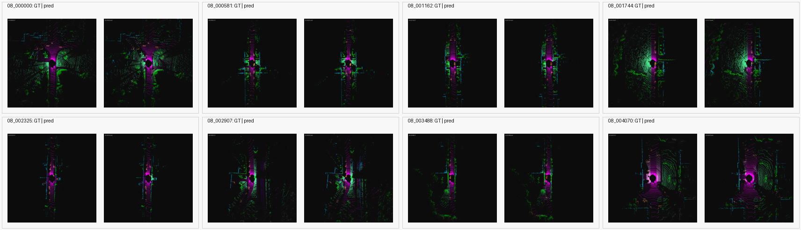
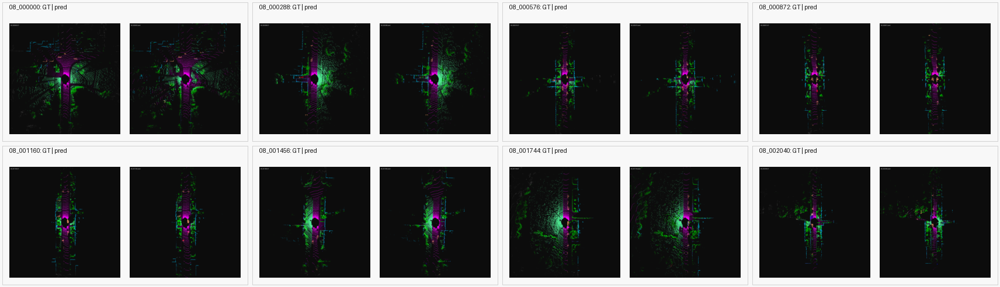
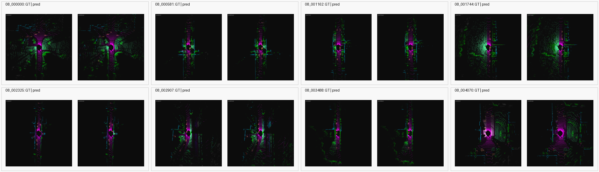

# Stage-2 Full SemanticKITTI Benchmark Results

This note records the completed stage-2 SemanticKITTI sequence `08` validation
benchmark. It compares the stronger LiDAR-only PTv3 baseline against the
IPFP/fused-training route that initializes from the LiDAR checkpoint and keeps
LiDAR-only inference as the primary evaluation route.

## Artifact Directories

| Run | Directory |
| --- | --- |
| Stronger LiDAR-only baseline | `results/semantic_kitti_full_benchmark/stage2_lidar_stronger_20260630_115149` |
| Fused training recovery run | `results/semantic_kitti_full_benchmark/stage2_fused_gate01_recovery2_20260630_162428` |

Committed artifacts are limited to JSON metrics, manifest files, benchmark
notes, and selected validation visualizations. Checkpoints and raw datasets are
not included.

## Run Configuration

Both runs use the full SemanticKITTI training split `00 01 02 03 04 05 06 07 09
10` and validate on sequence `08`.

| Setting | LiDAR baseline | Fused training |
| --- | ---: | ---: |
| Training frames | `19130` | `19130` |
| Validation frames | `4071` | `4071` |
| Train sample points | `32768` | `32768` |
| Eval chunk points | `32768` | `32768` |
| Loss | CE + Lovasz | CE + Lovasz |
| LR schedule | cosine, 2000 warmup, min `1e-5` | cosine, 2000 warmup, min `1e-5` |
| Class weighting | inverse sqrt frequency, clip `5.0` | inverse sqrt frequency, clip `5.0` |
| Rare-class frame sampling | `0.45` | `0.45` |
| Balanced point sampling | `0.50` | `0.50` |
| Steps | `60000` | `30000` |
| Initialization | random / normal model init | LiDAR `best.pth`, fresh IPFP |
| IPFP extra-feature scale | n/a | `0.1` |
| Fused sampling guard | n/a | min `512` visible points, `12` retries |

## Overall Results

The main paper-aligned comparison is the final LiDAR-only inference route after
fused training. This isolates whether multimodal training improves the LiDAR
model used at inference time.

| Route | Eval route | Frames | mIoU | Overall acc | Mean loss |
| --- | --- | ---: | ---: | ---: | ---: |
| Stage-1 LiDAR-only scaffold | LiDAR-only | 4071 | `19.01%` | `66.93%` | `1.7342` |
| Stage-2 stronger LiDAR-only | LiDAR-only | 4071 | `27.79%` | `75.59%` | `1.5952` |
| Stage-2 fused training | LiDAR-only | 4071 | `29.04%` | `80.12%` | `1.5005` |
| Stage-2 zero-feature fused path | LiDAR-only | 4071 | `28.93%` | `79.70%` | `1.5103` |
| Stage-2 fused diagnostic | Fused | 4071 | `29.21%` | `80.15%` | `1.4922` |

Relative to the stronger LiDAR-only baseline, fused training improves the
primary LiDAR-only inference route by `+1.25` mIoU points and `+4.53` overall
accuracy points. Relative to the original stage-1 scaffold, the full stage-2
pipeline improves mIoU by `+10.03` points.

The first stage-2 ablation shows that the zero-feature fused path reaches
`28.93%` full-sequence mIoU, only `0.12` points below the learned-feature fused
training run. This means the current fused-training gain should not yet be
attributed to learned image-feature content. See
[`docs/STAGE2_ABLATION_RESULTS.md`](STAGE2_ABLATION_RESULTS.md).

The fused diagnostic row should not be interpreted as a clean fused-inference
success yet. It recorded `4066` fallback counts on full sequence `08`, so most
of the diagnostic route still fell back to the LiDAR-only path.

## Fused Training Trend

Periodic validation uses a 256-frame subset with LiDAR-only inference. The full
validation at `30000` uses all `4071` sequence `08` frames.

| Step | Frames | Eval route | mIoU | Overall acc | Mean loss |
| ---: | ---: | --- | ---: | ---: | ---: |
| 5000 | 256 | LiDAR-only | `25.83%` | `77.63%` | `1.5089` |
| 10000 | 256 | LiDAR-only | `23.09%` | `72.91%` | `1.7350` |
| 15000 | 256 | LiDAR-only | `26.44%` | `78.99%` | `1.5389` |
| 20000 | 256 | LiDAR-only | `26.81%` | `76.29%` | `1.5880` |
| 25000 | 256 | LiDAR-only | `29.04%` | `81.13%` | `1.3969` |
| 30000 | 4071 | LiDAR-only | `29.04%` | `80.12%` | `1.5005` |

The curve dips around `10000` steps but recovers by `25000`. The final full
sequence validation confirms that the recovered model is not just overfitting
the periodic subset.

## Class-Wise IoU

| Class | LiDAR baseline IoU | Fused-trained LiDAR eval IoU | Delta | Fused diagnostic IoU |
| --- | ---: | ---: | ---: | ---: |
| car | `62.99%` | `67.79%` | `+4.80` | `68.37%` |
| bicycle | `5.14%` | `5.34%` | `+0.20` | `5.34%` |
| motorcycle | `10.29%` | `10.88%` | `+0.59` | `11.73%` |
| truck | `4.27%` | `3.32%` | `-0.95` | `3.73%` |
| other-vehicle | `5.21%` | `5.85%` | `+0.64` | `6.01%` |
| person | `8.48%` | `9.99%` | `+1.51` | `10.25%` |
| bicyclist | `12.11%` | `11.38%` | `-0.73` | `11.07%` |
| motorcyclist | `0.09%` | `0.03%` | `-0.06` | `0.06%` |
| road | `77.68%` | `81.75%` | `+4.07` | `81.85%` |
| parking | `8.28%` | `4.98%` | `-3.30` | `5.14%` |
| sidewalk | `51.12%` | `58.60%` | `+7.48` | `58.71%` |
| other-ground | `0.06%` | `0.02%` | `-0.04` | `0.01%` |
| building | `67.30%` | `68.59%` | `+1.29` | `68.48%` |
| fence | `19.59%` | `22.12%` | `+2.53` | `22.53%` |
| vegetation | `73.91%` | `78.37%` | `+4.45` | `78.37%` |
| trunk | `31.48%` | `17.41%` | `-14.08` | `17.51%` |
| terrain | `59.84%` | `63.99%` | `+4.15` | `64.03%` |
| pole | `18.69%` | `20.08%` | `+1.39` | `19.99%` |
| traffic-sign | `11.45%` | `21.31%` | `+9.87` | `21.76%` |

Largest gains are `traffic-sign`, `sidewalk`, `car`, `vegetation`, `terrain`,
and `road`. The largest drop is `trunk`, followed by `parking`; these should be
tracked in the next ablation round.

## Visualizations

Stage-2 LiDAR-only final full-sequence validation:

Fused-training periodic validation at `25000` steps:

Fused-training final validation at `30000` steps:

## Interpretation

The useful claim from this run is:

> Multimodal IPFP-style training with a small learned feature gate improved the
> final LiDAR-only SemanticKITTI sequence `08` validation score over the stronger
> LiDAR-only baseline.

The result does not yet prove that fused image-LiDAR inference is robust. The
diagnostic fused route is close numerically, but the heavy fallback count means
the path still mostly behaves like LiDAR-only inference. The next experiments
should therefore separate training-time benefit from inference-time fusion.

## Next Experiments

Run three controlled ablations from the same LiDAR checkpoint and with the same
stage-2 recipe:

1. `extra_feature_mode=zeros`: completed at `28.93%` full-sequence mIoU. This
   recovers nearly all of the learned-feature fused-training gain.
2. `ipfp_detach`: running remotely; this tests whether gradients through IPFP
   are helping or damaging the backbone.
3. LiDAR-only continued fine-tune for `30000` extra steps: queued remotely; this
   controls for extra optimization time after the 60000-step LiDAR baseline.

In parallel, diagnose fused inference fallback by logging the failure reason per
validation frame or chunk: insufficient visible points, invalid projected depth,
or no depth-constrained center candidates. Only after fallback is low should the
project claim fused inference improvement.
